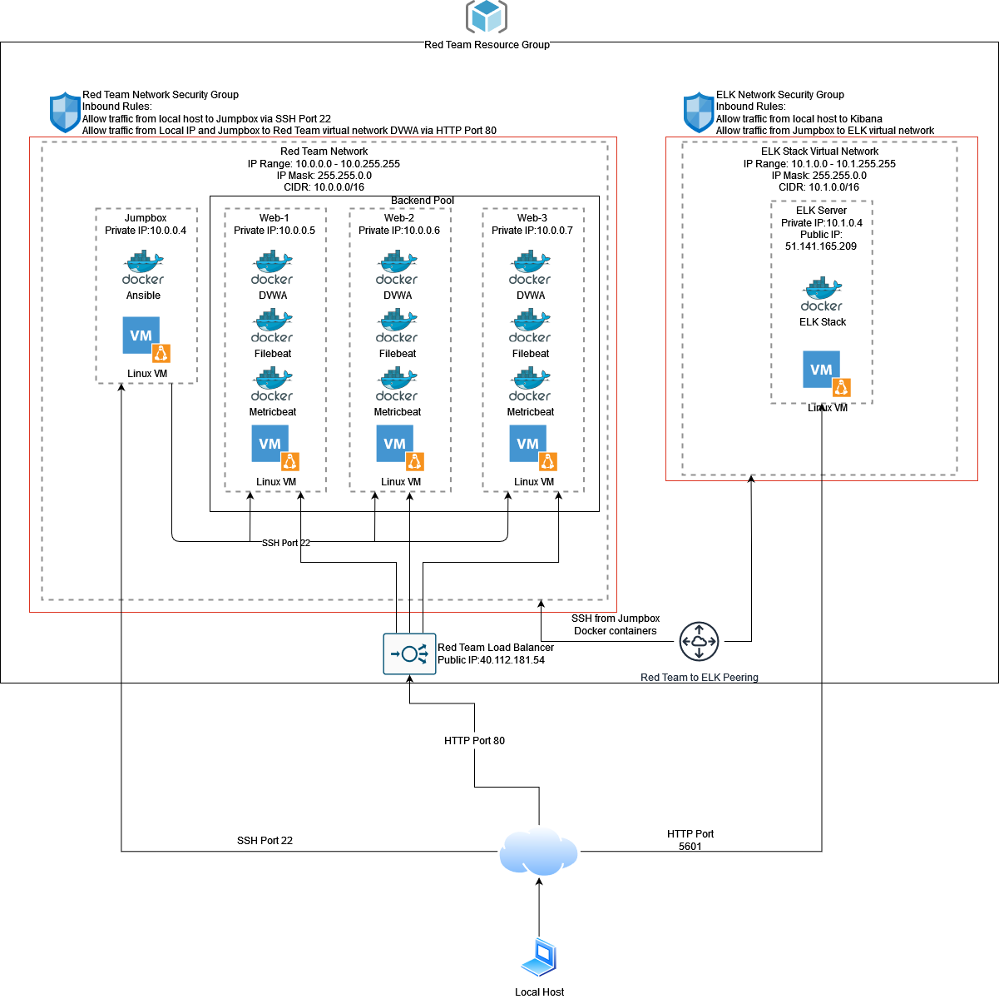
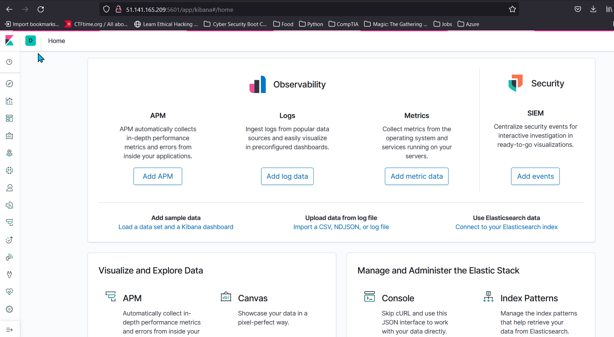

## Automated ELK Stack Deployment

The files in this repository were used to configure the network depicted below. Included with this image are also the YAML files used to configure the Filebeat and Metricbeat playbook and the configuration. 



These files have been tested and used to generate a live ELK deployment on Azure. They can be used to either recreate the entire deployment pictured above. Alternatively, select portions of the playbook file may be used to install only certain pieces of it, such as Filebeat.


``` YAML
---
- name: installing and launching filebeat
  hosts: webservers
  become: yes
  tasks:

  - name: download filebeat deb
    command: curl -L -O https://artifacts.elastic.co/downloads/beats/filebeat/fileb>
  - name: install filebeat deb
    command: dpkg -i filebeat-7.6.1-amd64.deb

  - name: drop in filebeat.yml
    copy:
      src: /etc/ansible/files/filebeat-config.yml
      dest: /etc/filebeat/filebeat.yml

  - name: enable and configure system module
    command: filebeat modules enable system

  - name: setup filebeat
    command: filebeat setup

  - name: start filebeat service
    command: service filebeat start

  - name: enable service filebeat on boot
    systemd:
      name: filebeat.service
      enabled: yes   
```


This document contains the following details:
- Description of the Topology
- Access Policies
- ELK Configuration
  - Beats in Use
  - Machines Being Monitored
- How to Use the Ansible Build


### Description of the Topology

The main purpose of this network is to expose a load-balanced and monitored instance of DVWA, the D*mn Vulnerable Web Application.

Load balancing ensures that the application will be highly available, in addition to restricting unwanted traffic to the network.

- Load balancers protect network availability by: 
  - distributing traffic to several servers instead of having one server handling all the incoming traffic. 
  - Ensuring that if one of the servers loses service another one will be there to handle requests. 
  - A load balancer also adds security by hiding how many servers are on the network. 
- A jump box is usefull for accessing our network because it will obfiscate the local IP of a security analyst or IT administrator.  

Integrating an ELK server allows users to easily monitor the vulnerable VMs for changes to the log data and system status._

- Filebeat functions by:
  - Monitoring log data and reports on changes in logs
  - Tells what activities are taking place on a system
- Metricbeat records:
  - System information such as OS
  - Applications and services running on the machine

The configuration details of each machine may be found below.

| Name     | Function           | IP Private | IP Public      | Operating System     |
| -------- | ------------------ | ---------- | -------------- | -------------------- |
| Jump Box | Gateway            | 10.0.0.4   | 104.42.75.89   | Linux (ubuntu 18.04) |
| Web-1    | DVWA Server        | 10.0.0.5   | N/A            | Linux (ubuntu 18.04) |
| Web-2    | DVWA Server        | 10.0.0.6   | N/A            | Linux (ubuntu 18.04) |
| Web-3    | DVWA Server Backup | 10.0.0.7   | N/A            | Linux (ubuntu 18.04) |
| ELK      | ELK Stack          | 10.1.0.4   | 51.141.165.209 | Linux (ubuntu 18.04) |

### Access Policies

The machines on the internal network are not exposed to the public Internet. 

Only the Jump Box machine can accept connections from the Internet. Access to this machine is only allowed from the local host.

Machines within the Red Team network can only be accessed by the Jump Box.
- The Jump Box can access the ELK Stack VM via SSH over port 22.
- The Local Host can access Kibana via the Elk Stacks Public IP over port 5601

A summary of the access policies in place can be found in the table below.

| Name          | Publicly Accessible | Allowed IP Addresses                     |
| ------------- | ------------------- | ---------------------------------------- |
|               |                     |                                          |
| Jump Box      | Yes                 | Local Public IP Address over Port 22 SSH |
| ELK Stack VM  | Yes                 | Local Public IP Address over Port 5601   |
| ELK Stack VM  |                     | 10.0.0.4 via Port 22 and Peering         |
| Web-1         | No                  | 10.0.0.4 via Port 22                     |
| Web-2         | No                  | 10.0.0.4 via Port 22                     |
| Web-3         | No                  | 10.0.0.4 via Port 22                     |
| Load Balancer | Yes                 | 40.112.181.54 via Port 80                |

### Elk Configuration

Ansible was used to automate configuration of the ELK machine. No configuration was performed manually, which is advantageous because...
- Ansible allows users to record what they have done
- Having a playbook allows other technicians to repeat this process
- Distribution with Ansible can be done for 1...n machines

The playbook implements the following tasks:
- The ELK VM will need docker installed in order to work:

  - ```yaml
        # Use apt module
        - name: Install docker.io
          apt:
            update_cache: yes
            force_apt_get: yes
            name: docker.io
            state: present
    ```

- Python 3 will also need to be installed as it will be used as the interpreter:

  - ```yaml
          # Use apt module
        - name: Install python3-pip
          apt:
            force_apt_get: yes
            name: python3-pip
            state: present
    ```

- Once this is done the Docker module can be installed

  - ```yaml
          # Use pip module (It will default to pip3)
        - name: Install Docker module
          pip:
            name: docker
            state: present
    ```

- The ELK stack needs an increased amount of memory to run:

  - ```yaml
          # Use command module
        - name: Increase virtual memory
          command: sysctl -w    	vm.max_map_count=262144
    ```

- To make sure this memory is used each time:

  - ```yaml
          # Use sysctl module
        - name: Use more memory
          sysctl:
            name: vm.overcommit_memory
            value: '1'
            state: present
            reload: yes
    ```

- The machine can now use Docker to download and launch an elk container

  - ```yaml
          # Use docker_container module
        - name: download and launch a docker elk       container
          docker_container:
            name: elk
            image: sebp/elk:761
            state: started
            restart_policy: always
            published_ports:
              -  5601:5601
              -  9200:9200
              -  5044:5044
    ```

- Finally using ```systemd``` module Docker can be configured to run the ELK container on start up

  - ```yaml
          # Use systemd module
        - name: Enable service docker on boot
          systemd:
            name: docker.service
            enabled: yes
    ```

- Using these steps in an Ansible playbook allows the automation of distributing ELK containers.

The following screenshot displays the result of running `docker ps` after successfully configuring the ELK instance.


### Target Machines & Beats
This ELK server is configured to monitor the following machines:

| Name  | Ip address | service |      |
| ----- | ---------- | ------- | ---- |
| Web-1 | 10.0.0.5   | DVWA    |      |
| Web-2 | 10.0.0.6   | DVWA    |      |
| Web-3 | 10.0.0.7   | DVWA    |      |

We have installed the following Beats on these machines:
- Filebeat and Metricbeat were both installed on Web-1, Web-2, and Web-3

These Beats allow us to collect the following information from each machine:
- Filebeat is an Elastic Beats that collects log files of a computer. Log files contain information of user logins, errors, and applications running on the machine.
- Metricbeat is used to collect metadata about each machine that is running such as OS, time up, and IP address

### Using the Playbook
In order to use the playbook, you will need to have an Ansible control node already configured. Assuming you have such a control node provisioned: 

SSH into the control node and follow the steps below:
- Copy the ```elk-playbook.yml``` file to Ansibles node  directory ```/etc/ansible```.

- Update the hosts file such there is an ``elk`` hosts section :

  - ```
    [elk]
    10.1.0.4 ansible_python_interpreter=/usr/bin/python3

- Run the playbook, and navigate to:

  - ```51.141.165.209:5601/app/kibana``` to see if the ELK servers are running if successful the following screen should appear.
  - 

_As a **Bonus**, provide the specific commands the user will need to run to download the playbook, update the files, etc._

To get the playbook use the following bash commands

```bash
curl https://github.com/isle17/Azure_ELK_Stack/commit/5fb38e919fa34b573151eccedc5f4322ecd38bd9#diff-91a556e871fde7f965323295d8377560e87467377457c0c1a97f967f27529dee >> install-elk.yml
```

